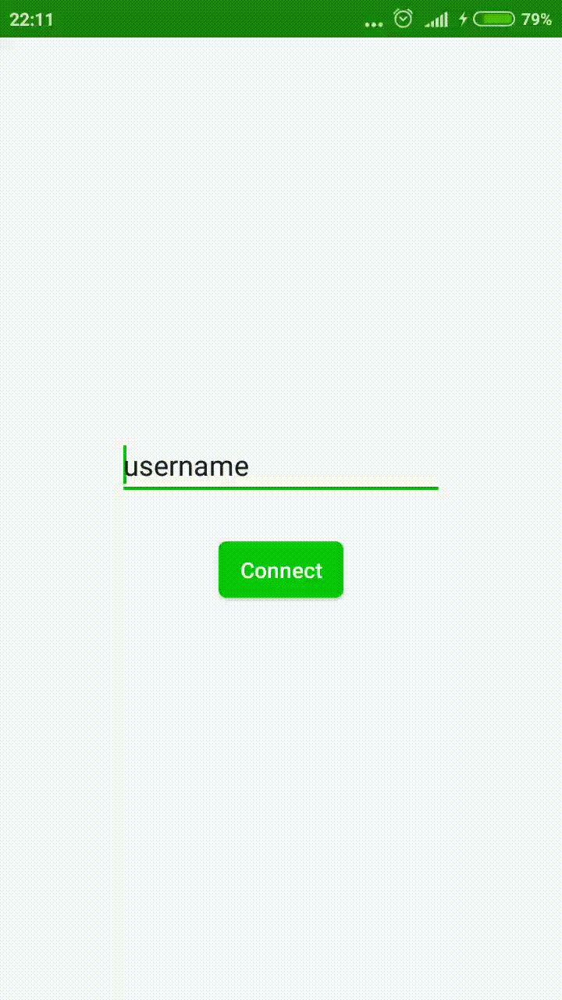
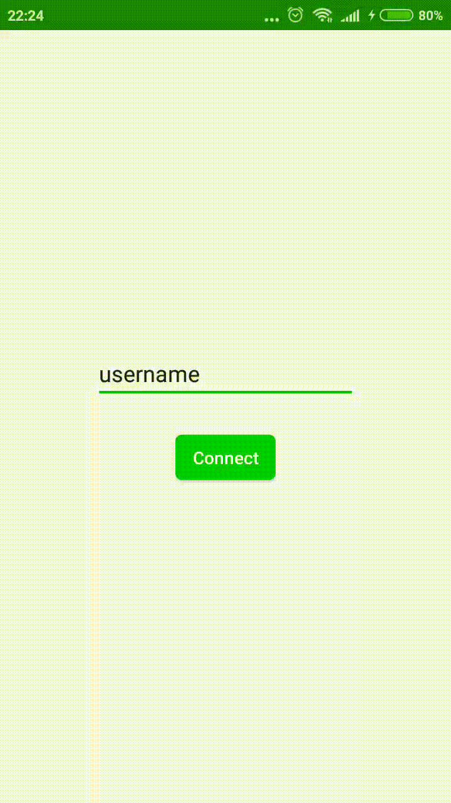
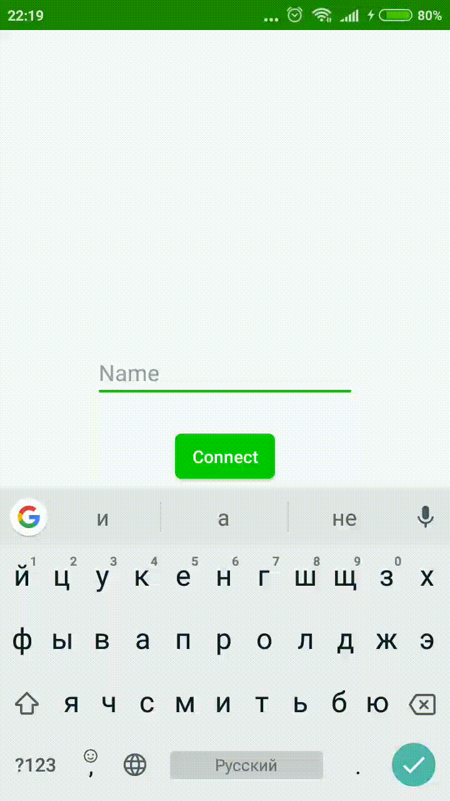
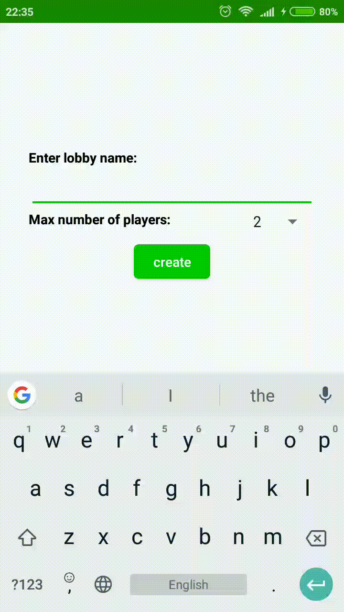

## Оценка текущего состояния ПО

### 1. Распознаваемость соответствия

На данный момент пользователь может понять, что из себя представляет игра, только на этапе игры. Информации о том, что это карточная настольная игра, нет ни на экране входа, ни во время создания лобби. В качестве ориентира пользователь имеет только название игры и иконку приложения. 

### 2. Обучаемость

На данный момент изучаемость функционала высока. Пользователь, который хоть раз пользовался приложениями Android, сможет уже после первой игры изучить основной функционал приложения. Поток сцен построен прямолиейно и на каждой находится до двух кнопок. 

### 3. Используемость

Приложение хорошо приспособлено для использования на современных устройствах Android. Для возвращения назад и вызова контекстного меню пользователь может использовать стандартные кнопки на смартфоне. Громкость фоновой музыки пользователь может регулировать также с помощью кнопок громкости на своем устройстве. Для входа в лобби достаточно нажать на элемент в списке лобби. 

### 4. Защита от ошибок пользователя

Данный атрибут не выполнятся совсем. Пользователь может ввести пустое имя, может создать лобби с пустым именем и др. В случае некорректного обрыва соединения (пользователь просто закрыл приложение или выключил смартфон) могут возникнуть проблемы. 

### 5. Эстетика GUI

Эстетика GUI нуждается в доработке. Пока единственным стилистически оформеленным местом ялвяется экран игры. Экраны входа в игру, подклчения к лобби и завершения партии выглядят очень сыро и стандартно. Это добавляет им интуитивности использования, но портит впечатление целостности продукта. 

### 6. Доступность

* Игра не локализована, играть могут люди только со знанием английского языка;
* В игру могут играть только люди, знакомые с правилами оригинальной игры.

## Пути улучшения UX

### Распознаваемость соответствия

На экраны входа в игру и создания лобби нужно добавить элементы UI, позволяющие пользователю понять, что он имеет дело с карточной игрой. Например, игровой стол на фоне или кнопки в форме игровых карт.

### Обучаемость

Уровень обучаемости приемлим и в доработке не нуждается.

### Используемость 

Уровень используемости приемлим и в доработке не нуждается.

### Защита от ошибок пользователя

Наиболее важным на данный момент является улучшения атрибута "Защита от ошибок пользователя", т. к. эти ошибки могут поставить его в недоумение. Повышение соответствия данному атрибуту будет производиться введением следующих улучшений:

- Если пользователь будет пытаться войти с путсым никнеймом, то ему выведется сообщение об ошибке;
- Если пользователь будет пытаться создать лобби с пустым именем, то ему выведется сообщение об ошибке;
- Если пользователь не включит интернет или WiFi и будет пытаться войти в игру, то ему выведется сообщение об отсутствии сетевого подключения.

### Эстетика GUI

Необходимо добавить стилистики элементам UI. Должны преобладать зеленый, синий и красный цвета на фоне, а цвет букв желательно должен быть желтым. Обязательно выбор близкого к оригиналу шрифта. 

### Доступность

* Необходимо добавить локализацию как минимум на русский язык;
* Пользователю должны быть доступны правила игры.

## Результаты

|                              До                              |                            После                             |                         Что изменили                         |
| :----------------------------------------------------------: | :----------------------------------------------------------: | :----------------------------------------------------------: |
|  |  | Добавили вывод сообщения о том, что пользователь не подключен к сети. |
|  |  | Добавили запрет на вход с пустым именем и вывод соответствующего сообщения. |
|  |  | Добавили запрет на создание лобби с пустым именем и вывод соответствующего сообщения. |
